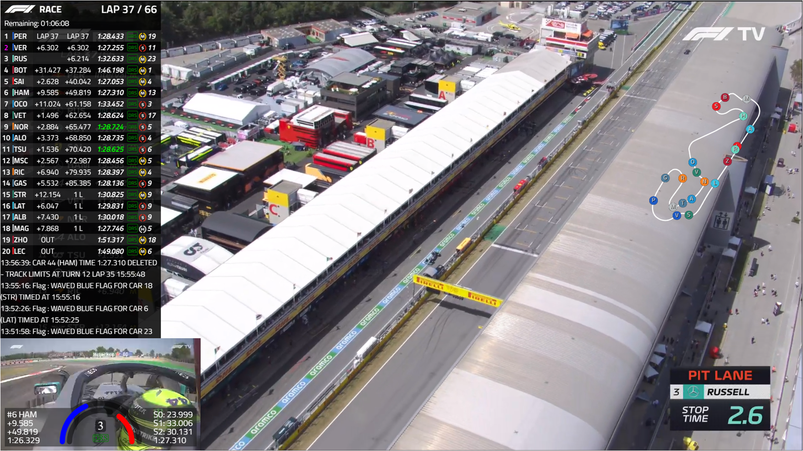
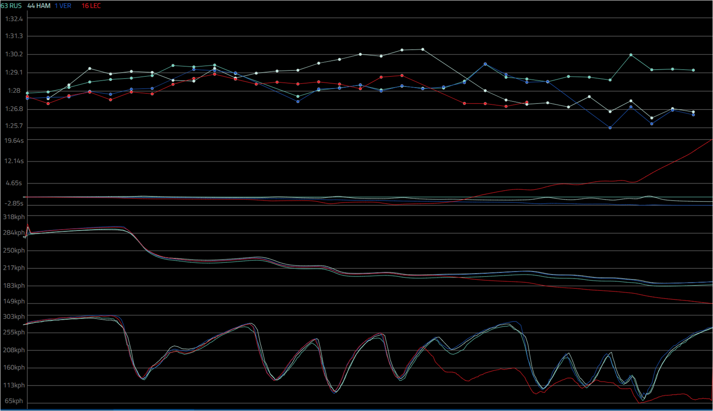
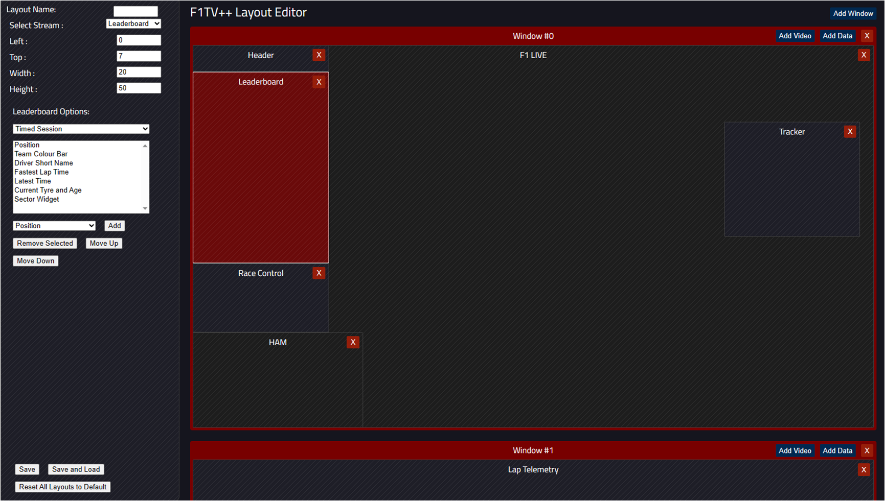

# F1TV++
Userscript that adds to F1TV. This was originally based on F1TV+ (https://github.com/najdek/f1tv_plus), but has essentially been completely re-written, there are some UI similarities.

## Installation
* Install the Tampermonkey extension for your browser:
  * [Google Chrome](https://chrome.google.com/webstore/detail/tampermonkey/dhdgffkkebhmkfjojejmpbldmpobfkfo)
  * [Microsoft Edge](https://microsoftedge.microsoft.com/addons/detail/tampermonkey/iikmkjmpaadaobahmlepeloendndfphd)
  * [Mozilla Firefox](https://addons.mozilla.org/en-US/firefox/addon/tampermonkey/)
* Click here to open the latest version of userscript: [[main-min.user.js]](https://raw.githubusercontent.com/Vern22/f1tv-plus-plus/master/main-min.user.js)
* Tampermonkey should detect userscript automatically. Click on "Install".

You may have to allow F1TV website to open popups.

There is a full editor in which you can customise any layout you like, to position the windows, configure the layout of the leaderboard, default video streams/volume etc. Just click "Edit" in the layout selector.

New Data Panel (experimental): Telemetry graphs, display speed/gear/throttle/brake over the course of a lap and compare to other drivers. Live doesn't currently work (WIP), you can also display a graph of all the lap times over a whole race.

## Screenshots

