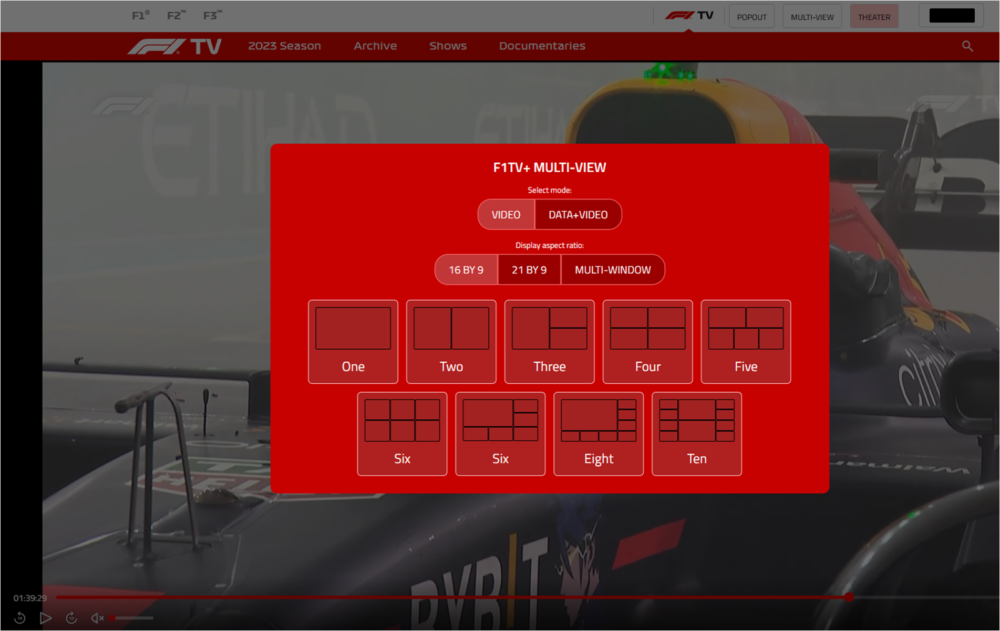
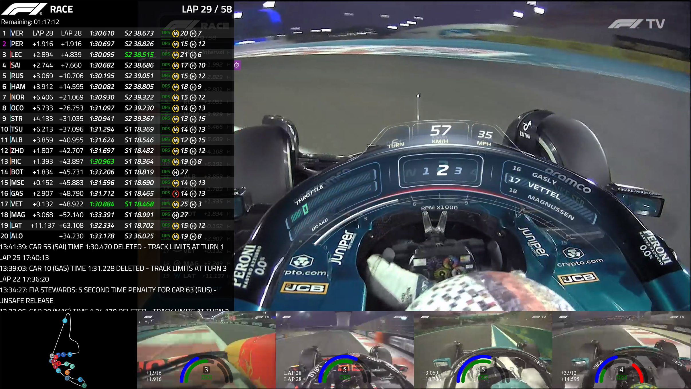
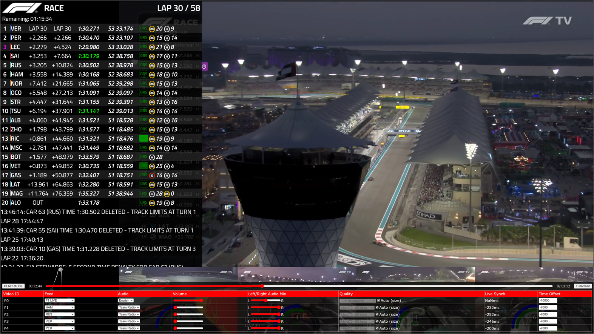

# F1TV++
Userscript that adds to F1TV. This was originally based on F1TV+ (https://github.com/najdek/f1tv_plus), but has had many changes

## Installation
* Install the Tampermonkey extension for your browser:
  * [Google Chrome](https://chrome.google.com/webstore/detail/tampermonkey/dhdgffkkebhmkfjojejmpbldmpobfkfo)
  * [Microsoft Edge](https://microsoftedge.microsoft.com/addons/detail/tampermonkey/iikmkjmpaadaobahmlepeloendndfphd)
  * [Mozilla Firefox](https://addons.mozilla.org/en-US/firefox/addon/tampermonkey/)
* Click here to open the latest version of userscript: [[main-min.user.js]](https://raw.githubusercontent.com/Vern22/f1tv-plus-plus/master/main-min.user.js)
* Tampermonkey should detect userscript automatically. Click on "Install".

You may have to allow F1TV website to open popups.

## Screenshots

